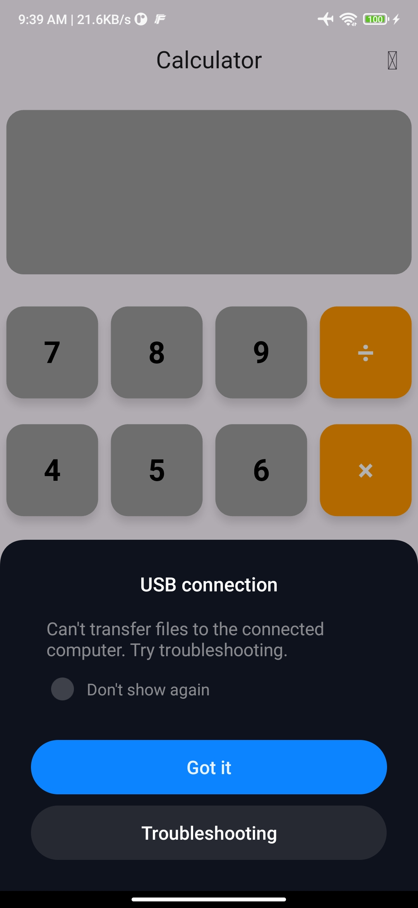
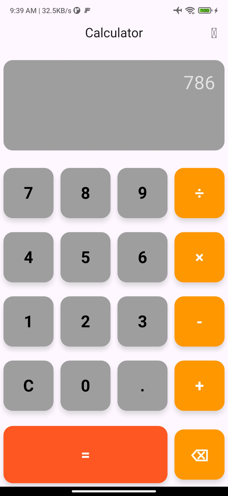
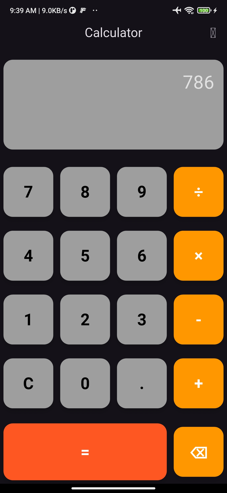
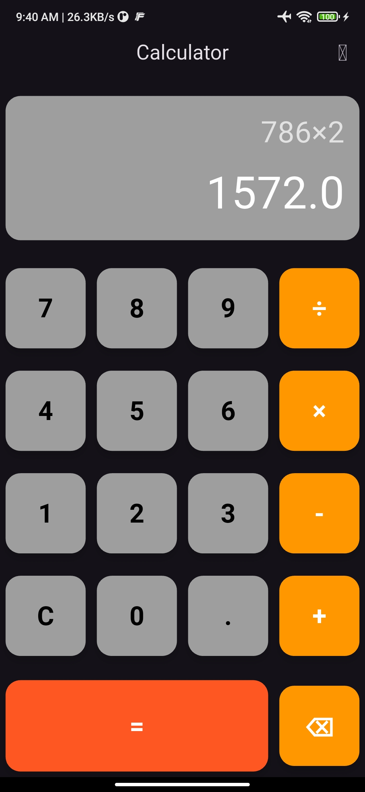

# 📱 Calc App

A modern, modular calculator app built using **Flutter**, leveraging **GetX**, **Clean Architecture**, and the **MVVM pattern** for scalable and maintainable code.

---

## 🚀 Features

- Basic calculator functionality (addition, subtraction, multiplication, division)
- Responsive UI
- Dark mode & Light mode support 🌗
- Modular architecture
- Easy navigation with GetX
- Clear separation of concerns using Clean Architecture

---

## 🧠 Architecture

This project follows the **Clean Architecture** principle and is structured using the **MVVM (Model-View-ViewModel)** pattern with **GetX** for state management and routing.

### 🏗️ Folder Structure

```

lib/
├── controller/            # ViewModels / Controllers for business logic
├── presentation/
│   ├── bindings/          # GetX Bindings for dependency injection
│   ├── pages/             # UI Screens
│   ├── widgets/           # Reusable widgets
├── routes/                # Route definitions using GetX

```

---

## 🧠 Understanding GetX (for Beginners)

This project uses **GetX** to simplify state management, dependency injection, and navigation. If you're new to GetX, here’s a quick explanation of how it's used in this app:

- **State Management:** Calculator logic (like number input and calculations) is handled inside controller classes. GetX makes UI updates reactive and efficient without the need for `setState()`.
- **Dependency Injection:** Controllers are injected and managed automatically using bindings, keeping the setup clean and decoupled.
- **Navigation:** GetX handles navigation without `BuildContext`, using route names and transitions easily defined in one place.

This makes the code **easier to read, scale, and test** — perfect for anyone learning clean, modern Flutter practices.

---

## 🔄 GetX Flow Overview (MVVM + Clean Architecture)

Here’s a simplified diagram showing how the app layers communicate using GetX:

```

\[ UI / View (Page) ]
↓   ↑
interacts with
↓   ↑
\[ ViewModel / Controller (in controller/) ]
↓
uses services / logic
↓
\[ Model / Data Layer ]

````

How GetX fits into each layer:

- **View (Pages):** Displays UI and observes reactive data from the controller.
- **Controller:** Handles all business logic and state, exposed via reactive variables.
- **Bindings:** Connects controllers to views automatically during navigation.
- **Routes:** Central place for managing navigation using GetX’s routing features.

---

## 📦 Dependencies

- [get](https://pub.dev/packages/get) - for state management, routing, and dependency injection

---

## 🛠️ Getting Started

### ✅ Prerequisites

- Flutter SDK installed
- Dart enabled

### 🚚 Installation

1. Clone the repository:

   git clone https://github.com/yourusername/calc_app.git


2. Navigate to the project directory:


   cd calc_app

3. Install dependencies:


   flutter pub get

4. Run the app:


   flutter run


---
## 🧩 Screenshots






## 🧩 Coming Soon

* Scientific calculator mode
* Custom themes
* Unit testing with mocking

---

## 📄 License

This project is licensed under the MIT License - see the [LICENSE](LICENSE) file for details.

---

## 🤝 Contributing

Pull requests are welcome! For major changes, please open an issue first to discuss what you would like to change.

---

## 🙌 Acknowledgements

* Flutter Devs Community
* The GetX package maintainers
* Clean Architecture resources by Uncle Bob

```

---

